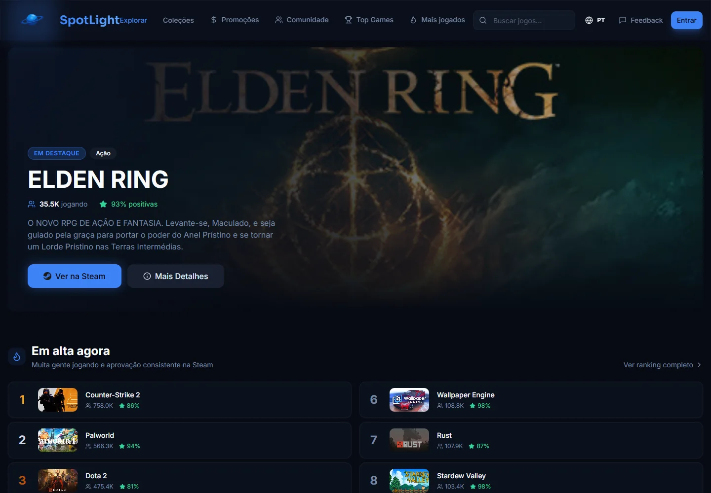
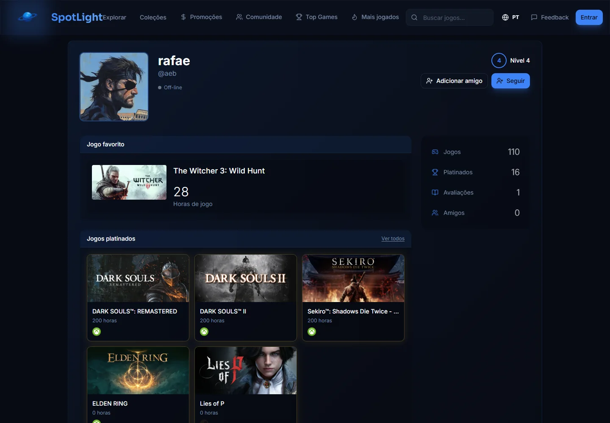
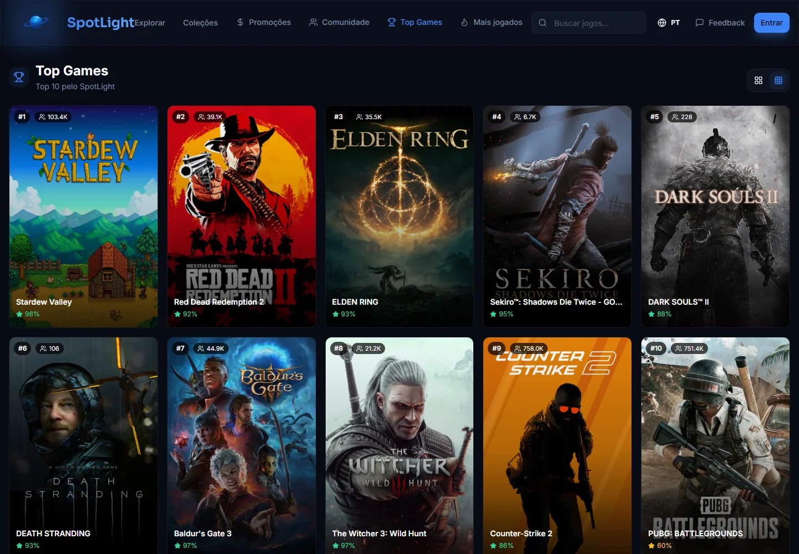
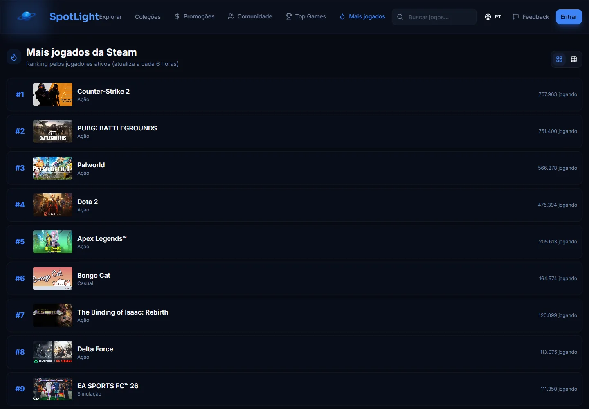

<div align="center">

# SpotLight

**Sua biblioteca, seus destaques e sua história gamer em um só perfil.**

[](https://spot-light-xi.vercel.app)
[](https://github.com/rafaelcairess/SpotLight/actions/workflows/ci.yml)
[](https://react.dev)
[](https://www.typescriptlang.org)
[](https://vitejs.dev)
[](https://tailwindcss.com)
[](https://supabase.com)
[](https://dotnet.microsoft.com)

**[→ Acessar o site](https://spot-light-xi.vercel.app)**

<br>

<a href="https://spot-light-xi.vercel.app">
  
</a>

<sub>Descubra jogos em destaque, tendências da Steam e recomendações em um só lugar.</sub>

</div>

---

## O problema

Você tem 150h no Steam, platinas no PSN e conquistas no Xbox. Três plataformas, três bibliotecas, três perfis que não conversam entre si. Para saber o que você já jogou, precisa abrir cada app separado. Para compartilhar sua história como gamer, não existe um lugar que conte tudo de uma vez.

O SpotLight nasceu para resolver exatamente isso.

---

## O que é o SpotLight

O SpotLight é um perfil gamer que reúne biblioteca, horas jogadas, destaques e conquistas em uma única vitrine. Hoje, a integração com a Steam já importa a biblioteca e sincroniza as horas automaticamente. Jogos e platinas de Xbox e PlayStation podem ser organizados manualmente enquanto as integrações oficiais dessas plataformas continuam em desenvolvimento.

Além de organizar o que você já jogou, o SpotLight ajuda a descobrir o próximo jogo com catálogo curado, rankings, promoções e dados atualizados da Steam.

### Status atual

| Status               | Funcionalidade                                                                 |
| -------------------- | ------------------------------------------------------------------------------ |
| Disponível           | Login, importação da biblioteca e sincronização de horas pela Steam            |
| Disponível           | Perfil público, privacidade, amigos, comentários, reviews e listas             |
| Disponível           | Jogos favoritos, vitrines de platinas e identificação manual da plataforma     |
| Disponível           | Explorar, busca, promoções, Top Games e ranking de jogadores ativos            |
| Em desenvolvimento   | Login e sincronização automática da biblioteca Xbox                            |
| Em desenvolvimento   | Login, biblioteca e troféus da PlayStation                                     |
| Experimental / local | API C# com validação JWT/JWKS e rota protegida `/api/me`                       |
| Planejado            | Integração do frontend com a API C# e migração gradual das regras hoje no Deno |

---

## Veja o SpotLight em funcionamento

### Um perfil para toda a sua história nos games

<a href="https://spot-light-xi.vercel.app/u/aeb">
  
</a>

<p align="center">
  <sub>Jogo favorito, nível, biblioteca e platinas de diferentes plataformas na mesma vitrine.</sub>
</p>

<table>
  <tr>
    <td width="50%">
      <a href="https://spot-light-xi.vercel.app/top">
        
      </a>
    </td>
    <td width="50%">
      <a href="https://spot-light-xi.vercel.app/mais-jogados">
        
      </a>
    </td>
  </tr>
  <tr>
    <td align="center">
      <strong>Top Games</strong><br>
      <sub>Os jogos mais bem avaliados pela comunidade.</sub>
    </td>
    <td align="center">
      <strong>Mais jogados</strong><br>
      <sub>Jogadores ativos na Steam, com atualização periódica.</sub>
    </td>
  </tr>
</table>

---

## Funcionalidades

### Biblioteca pessoal

- Horas jogadas sincronizadas via Steam ou inseridas manualmente
- Jogos privados ou ocultos por usuário
- Jogo favorito e até seis jogos platinados em vitrines do perfil
- Plataforma da platina identificada como Steam, Xbox ou PlayStation

### Integração com plataformas

- **Steam** — biblioteca completa e horas jogadas sincronizadas via Steam Web API
- **Xbox** — fluxo OAuth e sincronização em desenvolvimento
- **PlayStation** — fluxo OAuth e troféus em desenvolvimento

### Perfil e estatísticas

- Perfil público em `/u/:username` com avatar, bio e vitrine de platinas
- Nível próprio do SpotLight
- Amigos, presença, privacidade e comentários no perfil
- Escolha manual da plataforma e das horas jogadas

### Descoberta de jogos

- Catálogo dinâmico atualizado a cada 6 horas com dados da Steam
- Busca por nome com resultados em tempo real
- Rankings curados: **Mais Vendidos**, **Mais Jogados**, **Top Games**
- Coleções temáticas (co-op, indie, lançamentos…)
- Recomendações personalizadas com base na sua biblioteca

### Alertas de preço

- Configure um preço-alvo para qualquer jogo da sua wishlist
- Receba e-mail quando o preço cair abaixo do alvo

### Reviews e comunidade

- Escreva reviews com nota e texto para qualquer jogo
- Veja o que outros jogadores acharam antes de comprar
- Listas públicas e compartilháveis criadas pela comunidade

---

## Stack

| Camada              | Tecnologia                                   |
| ------------------- | -------------------------------------------- |
| Frontend            | React 18 + TypeScript + Vite 7               |
| UI                  | TailwindCSS 3 + shadcn/ui + Radix UI         |
| Estado / Dados      | TanStack Query (React Query)                 |
| Backend             | Supabase (PostgreSQL + Auth + RLS + Storage) |
| Edge Functions      | Supabase Edge Functions (Deno)               |
| API C#              | ASP.NET Core 8 (experimental e local)        |
| Deploy              | Vercel                                       |
| CI/CD               | GitHub Actions                               |
| Internacionalização | react-i18next (PT, EN, ES)                   |
| Tratamento de erros | React Error Boundaries                       |

### Migração do backend C#

A API ASP.NET Core já valida os tokens assimétricos emitidos pelo Supabase e
possui a rota protegida `/api/me`. Ela ainda não está conectada ao frontend nem
hospedada: nesta fase, funciona localmente como base didática para a migração.

#### Roadmap

- [x] Estrutura inicial da API e health check
- [x] Autenticação C# com JWT/JWKS do Supabase
- [ ] PostgreSQL com Entity Framework Core
- [ ] Leitura e edição de perfis pela API C#
- [ ] Migração da sincronização Steam para C#
- [ ] Conexão do frontend com a nova API
- [ ] Hospedagem da API no Render

<details>
<summary><strong>Edge Functions atuais (Deno)</strong></summary>

<br>

| Função                                 | Descrição                                                           |
| -------------------------------------- | ------------------------------------------------------------------- |
| `steam-auth-start`                     | Inicia fluxo OpenID 2.0 da Steam                                    |
| `steam-auth-callback`                  | Valida retorno da Steam, cria/atualiza usuário e importa biblioteca |
| `sync-steam-playtime`                  | Atualiza horas jogadas via Steam Web API                            |
| `xbox-auth-start`                      | Inicia fluxo OAuth 2.0 da Microsoft para Xbox                       |
| `xbox-auth-callback`                   | Valida token Xbox e salva XUID/Gamertag                             |
| `sync-xbox-library`                    | Sincroniza biblioteca Xbox Live                                     |
| `psn-auth-start` / `psn-auth-callback` | Fluxo OAuth PSN (Sony)                                              |
| `sync-psn-trophies`                    | Sincroniza troféus PSN                                              |
| `fetch-steam-details`                  | Busca detalhes enriquecidos de um jogo na Steam Store API           |
| `search-steam`                         | Pesquisa jogos na Steam para o catálogo                             |
| `send-price-alert-email`               | Dispara e-mail de alerta de preço                                   |

</details>

---

## Estrutura do projeto

Para saber onde alterar cada funcionalidade, como os dados percorrem o sistema e
quais regras seguir no backend, consulte o
[`docs/ARCHITECTURE.md`](docs/ARCHITECTURE.md).

```
src/
├── components/          # Componentes globais (Header, ErrorBoundary…)
├── config/              # Constantes e chaves de configuração
├── contexts/            # React contexts (Auth, Language)
├── features/
│   ├── alerts/          # Alertas de preço
│   ├── auth/            # Login, cadastro, OAuth
│   ├── collections/     # Coleções temáticas
│   ├── community/       # Feed da comunidade
│   ├── explore/         # Página inicial / descoberta
│   ├── games/           # Modal, página e componentes de jogo
│   ├── lists/           # Listas personalizadas
│   ├── most-played/     # Ranking de mais jogados
│   ├── onboarding/      # Onboarding e WhatsNew modal
│   ├── profile/         # Perfil próprio e público
│   ├── promotions/      # Promoções e descontos
│   ├── reviews/         # Formulário de review
│   ├── search/          # Busca de jogos
│   └── top/             # Ranking top jogos
├── hooks/               # Hooks de dados (React Query)
├── i18n/                # Traduções PT/EN/ES
├── integrations/        # Cliente Supabase e tipos gerados
├── lib/                 # Utilitários de domínio
└── types/               # Types globais TypeScript

supabase/
├── functions/           # Edge Functions (Deno)
└── migrations/          # Migrations SQL versionadas

backend/
├── SpotLight.Api/       # API ASP.NET Core comentada e didática
├── SpotLight.Api.Tests/ # Testes automatizados em C# e xUnit
└── SpotLight.sln        # Solution que reúne os projetos .NET
```

---

## Contribuição

O README principal apresenta o produto. Instruções de instalação, testes,
variáveis de ambiente e padrões de contribuição estão em
[`CONTRIBUTING.md`](CONTRIBUTING.md).

---

## Segurança

- **RLS (Row Level Security)** aplica regras de propriedade e respeita a privacidade configurada para perfis, bibliotecas e conteúdo público
- **CSRF protection** com nonce em cookie HttpOnly nos fluxos Steam OpenID e Xbox OAuth
- **JWT/JWKS assimétrico** validado pela API C# sem armazenar o segredo de assinatura
- **Rate limiting** persistente para comentários, reviews, amizades e outras escritas
- Origens de redirect validadas contra lista de domínios permitidos explícita

---

<div align="center">

Um perfil para toda a sua vida nos games.

</div>
